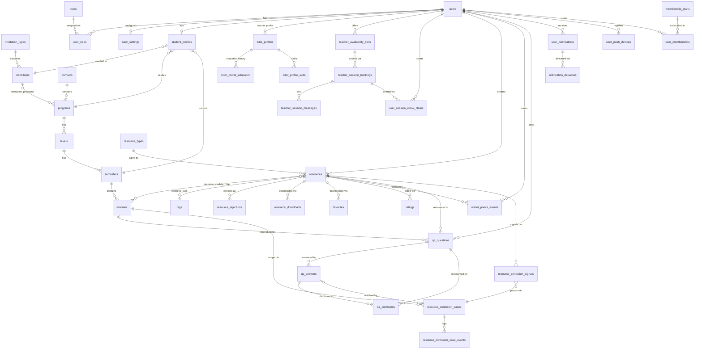
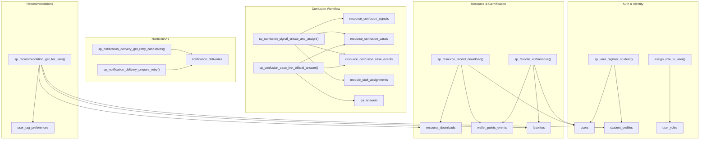
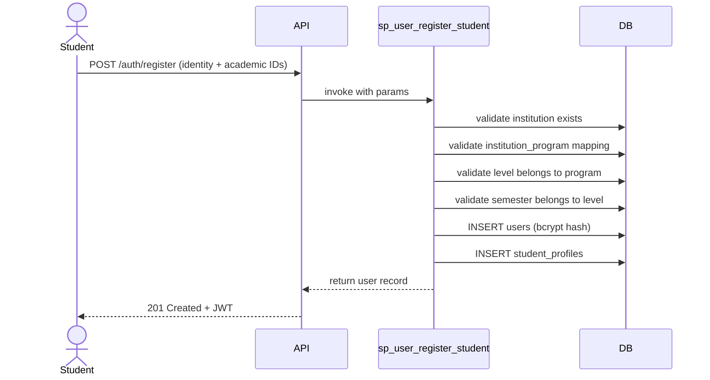
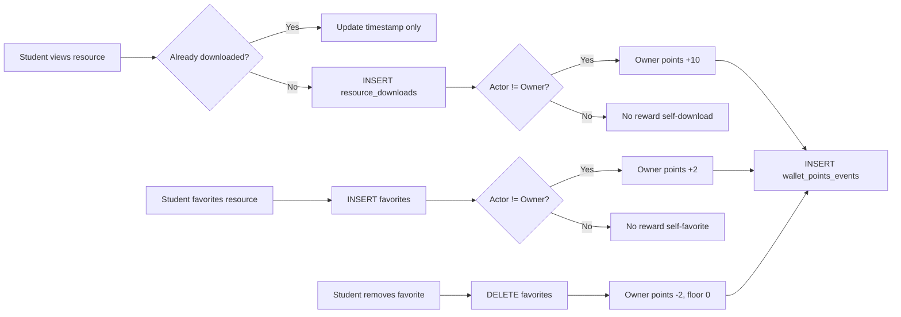
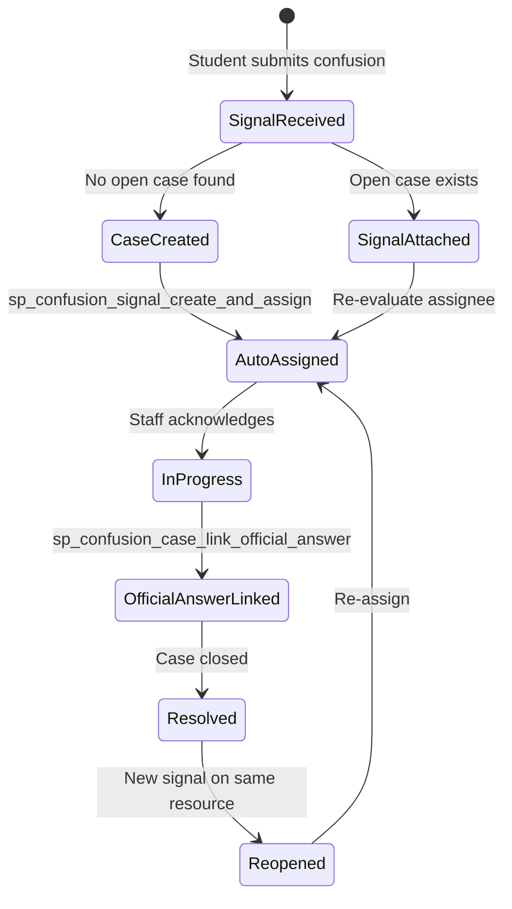
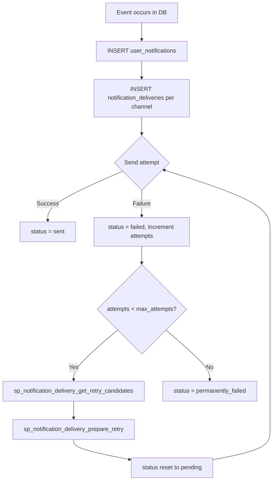
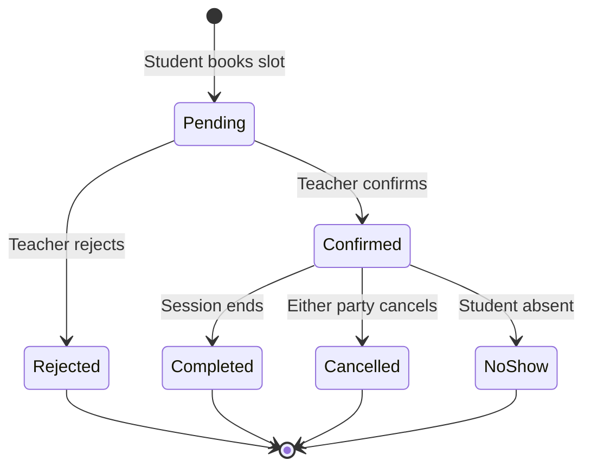
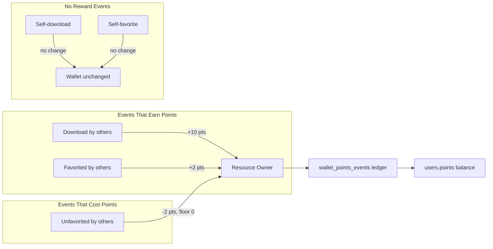

# Database Architecture & Technical Documentation

## 1. PROJECT STRUCTURE

```
Database/
├── Schema/                 # Visual Entity-Relationship Diagrams (ERD) and architecture exports
├── diagnostics/            # Performance diagnostics, index bloat queries, and query analysis scripts
├── migrations/             # Sequential SQL migration files for incremental DDL/DML evolutions
├── procedures/             # PL/pgSQL stored procedures and database function source code (`sp_*`)
├── seeds/                  # Master seed scripts and test data fixtures for local development
└── vues/                   # SQL view definitions (`vw_*`) for analytical reporting and dashboards
```

* **Master DDL Entry Point:** `database_DDL.sql` — Single consolidated source of truth containing complete schema tables, enums, constraints, triggers, and core PL/pgSQL routines.
* **Existing Documentation:** `Database_Documentation.md` — Detailed manual detailing business workflows, ERD text graphs, and function execution patterns.

---

## 2. SCHEMA ARCHITECTURE & DESIGN PATTERNS

* **Database Engine:** PostgreSQL 16+ leveraging native `PL/pgSQL`, custom `ENUM` types, table inheritance, `JSONB` document fields, and advanced partial/covering indexing.
* **Function-Heavy Architecture:** Business logic, transactional validation, and data mutations are heavily encapsulated within database functions (`sp_*`) and triggers, guaranteeing data integrity at the database layer.
* **Immutability & Ledgers:** Engagement events (downloads, favorites, wallet point transactions, confusion case events) employ append-only ledger patterns to guarantee auditability and prevent concurrency race conditions.
* **Timestamp & Audit Triggers:** Every mutable table binds a before-update trigger executing `set_updated_at()` / `sp_*_set_updated_at()` to ensure precise `updated_at` timestamps.

### Full Entity Relationship Diagram



---

## 3. TABLES & CONSTRAINTS INVENTORY

### Identity, Roles & Settings
* `users` | pk: `id` | fks: none | Unique `email`. Tracks credentials, activation, and wallet `points`.
* `roles` | pk: `id` | fks: none | Unique `name` (`admin`, `teacher`, `student`).
* `user_roles` | pk: `(user_id, role_id)` | fks: `users`, `roles` | Composite pivot. Indexed for RBAC lookups.
* `user_settings` | pk: `user_id` | fks: `users` | Stores UI theme, locale, notification channels, and privacy flags.
* `student_profiles` | pk: `user_id` | fks: `users`, `institutions`, `programs`, `semesters` | Validates academic hierarchy coherence. Tracks `contribution_mode`.

### Academic Master Taxonomy
* `domains` | pk: `id` | fks: none | Unique `name`. Top-level academic faculties.
* `institution_types`| pk: `id` | fks: none | Unique `name`. School classifications.
* `institutions` | pk: `id` | fks: `institution_types` | Unique composite `(name, country, city)`.
* `programs` | pk: `id` | fks: `domains` | Unique composite `(domain_id, name)`.
* `institution_programs`| pk: `(institution_id, program_id)` | fks: `institutions`, `programs` | M:N pivot table.
* `levels` | pk: `id` | fks: `programs` | Unique composite `(program_id, name)`. Ordered academic years.
* `semesters` | pk: `id` | fks: `levels` | Unique composite `(level_id, name)`. Ordered academic terms.
* `modules` | pk: `id` | fks: `semesters` | Unique composite `(semester_id, title)`. Teaching subjects.
* `module_staff_assignments`| pk: `id` | fks: `modules`, `users` | Partial unique index enforces single active primary teacher per module.

### Learning Resources & Tagging
* `resource_types` | pk: `id` | fks: none | Unique `name` and `slug`. Formats catalog (`pdf`, `video`).
* `resources` | pk: `id` | fks: `users`, `resource_types` | Main content entity. Stores S3/R2 storage keys, checksums, metadata JSONB, and `access_tier` (`free|premium`).
* `resource_module_map`| pk: `(module_id, resource_id)` | fks: `modules`, `resources` | Pedagogical attributes (`difficulty`, `chapter`, `exam_related`).
* `tags` | pk: `id` | fks: `users` | Controlled vocabulary taxonomy. Unique `slug`.
* `resource_tags` | pk: `(resource_id, tag_id)` | fks: `resources`, `tags` | M:N resource categorization pivot.
* `resource_rejections`| pk: `id` | fks: `users` (uploader, reviewer) | Moderation archive storing rejected content JSONB snapshots.

### Tutoring Consultations (`v2`)
* `tutor_profiles` | pk: `user_id` | fks: `users` | Tracks `hourly_rate`, `verification_status`, `visibility_status`.
* `tutor_profile_education`| pk: `id` | fks: `tutor_profiles` | Degree, institution, and graduation timeline with `sort_order`.
* `tutor_profile_skills`| pk: `id` | fks: `tutor_profiles` | Controlled tutor skill strings. Unique composite CI index.
* `teacher_availability_slots`| pk: `id` | fks: `users` | Tracks bookable time windows, `duration_minutes`, `price`.
* `teacher_session_bookings`| pk: `id` | fks: `teacher_availability_slots`, `users` | Lifecycle statuses: `pending`, `confirmed`, `rejected`, `cancelled`, `completed`, `no_show`. Tracks moderation reason and actor tracking FKs.
* `teacher_session_messages`| pk: `id` | fks: `teacher_session_bookings`, `users` | Consultation chat ledger.
* `user_session_inbox_clears`| pk: `(user_id, booking_id)` | fks: `users`, `teacher_session_bookings` | User inbox dismiss state tracking.

### Gamification & Engagement
* `favorites` | pk: `(user_id, resource_id)` | fks: `users`, `resources` | User bookmarks. Triggers owner reward/penalty (+2/-2 pts).
* `ratings` | pk: `(user_id, resource_id)` | fks: `users`, `resources` | 1-5 star score and review text.
* `resource_downloads`| pk: `id` | fks: `users`, `resources` | Unique composite `(user_id, resource_id)` prevents download reward gaming (+10 pts).
* `wallet_points_events`| pk: `id` | fks: `users`, `resources` | Immutable audit ledger logging points delta events.

### Q&A & Confusion Support
* `qa_questions` | pk: `id` | fks: `modules`, `resources`, `users` | Triggers validate question targets against `resource_module_map`.
* `qa_answers` | pk: `id` | fks: `qa_questions`, `users` | Partial unique index enforces exactly one accepted answer per question.
* `qa_comments` | pk: `id` | fks: `qa_questions`, `qa_answers`, `users` | XOR check constraint (`question_id` XOR `answer_id`).
* `resource_confusion_signals`| pk: `id` | fks: `resources`, `users` | Student difficulty reports.
* `resource_confusion_cases`| pk: `id` | fks: `resources`, `modules`, `users`, `qa_answers` | Workflow aggregate tracking case priority and staff assignment.
* `resource_confusion_case_events`| pk: `id` | fks: `resource_confusion_cases`, `users` | Append-only event history (`case_created`, `auto_assigned`, `resolved`).

### Notifications & Premium Subscriptions
* `user_notifications`| pk: `id` | fks: `users` | In-app alerts. Tracks `is_read`, `read_at`, `is_cleared`.
* `notification_deliveries`| pk: `id` | fks: `user_notifications` | External channel jobs (`email|push`). Tracks retry attempts.
* `user_push_devices`| pk: `id` | fks: `users` | Push tokens. Checked against platforms (`web|android|ios`).
* `membership_plans` | pk: `id` | fks: none | Subscription catalog. Unique `code`.
* `user_memberships` | pk: `id` | fks: `users`, `membership_plans` | Active subscription tracking.

---

## 4. STORED PROCEDURES & FUNCTIONS (`sp_*`)

### Function Dependency Graph



### User & Academic Workflows
* `sp_user_register_student` | type: function | params: full_name, email, pass, academic_ids | returns: user record | Validates academic hierarchy and creates student profile.
* `sp_student_profile_update` | type: function | params: user_id, academic_ids | returns: profile record | Updates and validates student academic mappings.
* `assign_role_to_user` / `remove_role_from_user` | type: procedure | params: user_id, role_id | returns: void | Mutates `user_roles` pivot.

### Resource Lifecycle & Gamification
* `sp_resource_create` | type: function | params: metadata, storage | returns: resource id | Validates and creates resource entity.
* `sp_resource_record_download` | type: function | params: user_id, resource_id | returns: success, points | Deduplicates downloads, updates owner points (+10), and writes ledger row.
* `sp_favorite_add` / `sp_favorite_remove` | type: function | params: user_id, resource_id | returns: record/bool | Toggles favorite, updates owner points (+2/-2), and writes ledger row.

### Tutoring & Q&A Workflows
* `sp_tutor_profiles_set_updated_at` | type: trigger | params: none | returns: trigger | Auto-updates timestamps across tutor profiles, education, and skills.
* `sp_confusion_signal_create_and_assign` | type: function | params: resource, module, student, note | returns: case metadata | Intake, deduplication, auto-assignment, and event dispatch.
* `sp_confusion_case_link_official_answer` | type: function | params: question, answer, actor | returns: case record | Links official answer and resolves active confusion case.

### Notifications & Recommendations
* `sp_notification_delivery_get_retry_candidates` | type: function | params: max_attempts, delay, limit | returns: rows | Selects failed delivery jobs using exponential backoff.
* `sp_notification_delivery_prepare_retry` | type: function | params: delivery_id | returns: record | Resets delivery status to pending and increments attempts.
* `sp_recommendation_get_for_user` | type: function | params: user_id, limit | returns: rows | Multi-factor weighted recommendation ranking (tags, profile, quality).

---

## 5. VIEWS & ANALYTICAL MODELS (`vw_*`)

| View Name | Source Tables | Purpose |
| :--- | :--- | :--- |
| `vw_resource_tags` | `resources`, `resource_tags`, `tags` | Flattened mapping of active resources to their descriptive tags. |
| `vw_tags_popularity` | `tags`, `resource_tags`, `resources` | Aggregated metrics evaluating tag usage frequency and recent activity. |
| `vw_resource_rejections`| `resource_rejections`, `users` | Enriched moderation view providing uploader and reviewer context. |
| `vw_admin_students_list`| `users`, `student_profiles`, `institutions` | High-level admin listing of student profiles and academic affiliations. |
| `vw_admin_student_full_details`| `users`, `student_profiles`, `wallet_points` | Comprehensive 360-degree student view combining profile and points. |
| `vw_admin_students_statistics`| `users`, `resources`, `wallet_points` | Aggregated gamification, upload, and engagement metrics per student. |
| `vw_admin_student_resources`| `resources`, `resource_downloads`, `favorites`| Flattened resource catalog detailing per-resource engagement counts. |

---

## 6. BUSINESS WORKFLOWS

### Workflow A: Student Registration & Onboarding



### Workflow B: Resource Engagement & Rewards



### Workflow C: Confusion Case Management



### Workflow D: Notification Delivery & Retry



### Workflow E: Tutoring Session Booking Lifecycle



---

## 7. MIGRATION TIMELINE

```mermaid
timeline
    title Database Migration History
    section Core Identity
        001 : Resource reward ledger
        002 : Fix favorite reward output
    section Q&A System
        003 : QA core tables
        004 : Enforce QA question-resource required
        005 : Resource storage metadata
        005b : QA question integrity cleanup
    section Tagging & Discovery
        006 : Resource confusion signals
        006b : Tags core schema
        007 : Tag batch lookup function
    section Moderation
        008 : Resource rejections table
        009 : Student registration procedure
    section Engagement & Notifications
        010 : Confusion cases + notifications workflow
        010b : Membership and access_tier
        011 : Notification channels v2
        011b : Wallet analytics procedures
        012 : Notification retry functions
        012b : Personalization and recommendations
    section Optimization
        013 : Tag popularity view
        014 : Tag usage breakdown
        015 : Exclude admins from rewards
        016 : Discover bootstrap function
        017 : Optimize discover bootstrap
    section Tutoring System
        018 : Student contribution mode
        019 : QA notification recipient resolver
        020 : QA notification performance indexes
        021 : Teacher sessions v1
        022 : Fix session booking unique constraint
        023 : User avatar fields
        024 : Inbox clear flags
        025 : Tutor pricing profiles
        026 : Session bookings metadata
        027 : Booking request lifecycle
        028 : Simplify tutor slots schema
        029 : Tutor profiles tables
```



---

## 8. PERFORMANCE & INDEXING

* **Covering & Composite Indexes:** High-frequency foreign keys and join pivots (`user_roles`, `resource_tags`, `resource_module_map`) utilize explicit composite BTREE indexes to prevent full-table scans.
* **Partial Filtering Indexes:** Search and task-worker queries leverage partial indexes to maintain compact index trees:
  * `idx_teacher_slots_bookable`: `(is_active, start_at) WHERE (is_active = true)`
  * `idx_notifications_recipient_not_cleared`: `(recipient_user_id, created_at DESC) WHERE (is_cleared = false)`
  * `uq_confusion_case_open`: `(student_id, resource_id, module_id) WHERE (status <> 'resolu')`
* **JSONB Indexing:** Snapshot and metadata JSON fields utilize `GIN` or targeted path expressions to support performant document querying.

### Points Economy Summary



---

## 9. KNOWN ISSUES & TODOS

* **Routine Definition Duplication:** Several PL/pgSQL function definitions are duplicated between consolidated files (`procedures.sql`) and modular domain files (`favorites.sql`, `module.sql`), creating potential execution drift during deployment.
* **Overlapping Indexes:** Certain engagement tables (`favorites`, `ratings`) possess similar composite indexes. A planned index optimization pass will review production query plans to prune redundant index trees.
* **Legacy Routine Drift:** Certain older resource routines still reference deprecated status strings or missing taxonomy IDs. Ongoing refactors aim to standardize all routines around `resource_type_id` and strict enum constraints.

---

## Quick Context for AI Agents

The MUS (Moroccan University Students) Database is a highly structured PostgreSQL 16+ project encapsulating core business logic, gamification ledgers, and academic taxonomies inside robust PL/pgSQL functions (`sp_*`) and triggers. It powers multi-role workflows including student onboarding, R2/S3 resource publishing, tutoring consultations (`v2`), and automated confusion case assignment. When writing migrations or modifying schema, maintain strict append-only ledger patterns for engagement events, enforce data integrity via explicit `CHECK` constraints and `ENUM` types, leverage partial BTREE indexes for task-worker queues, and ensure all routine updates are reflected in `database_DDL.sql`.
