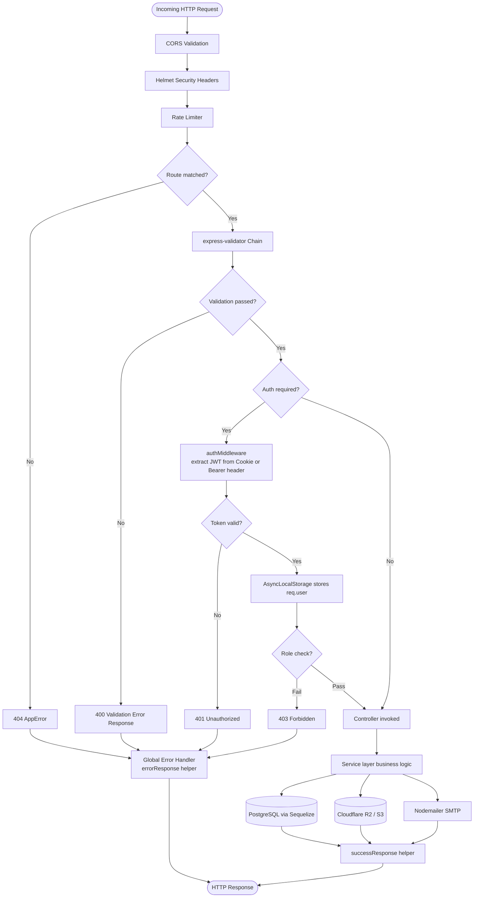
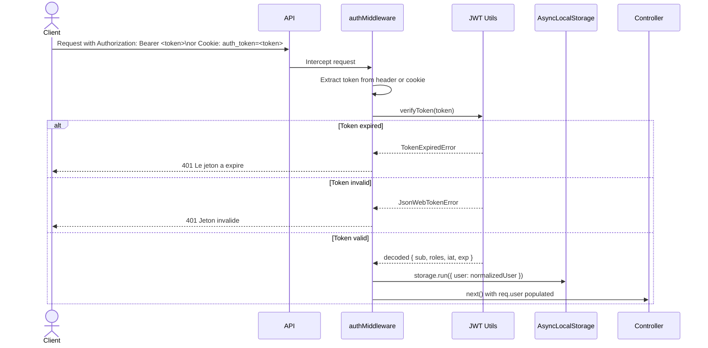
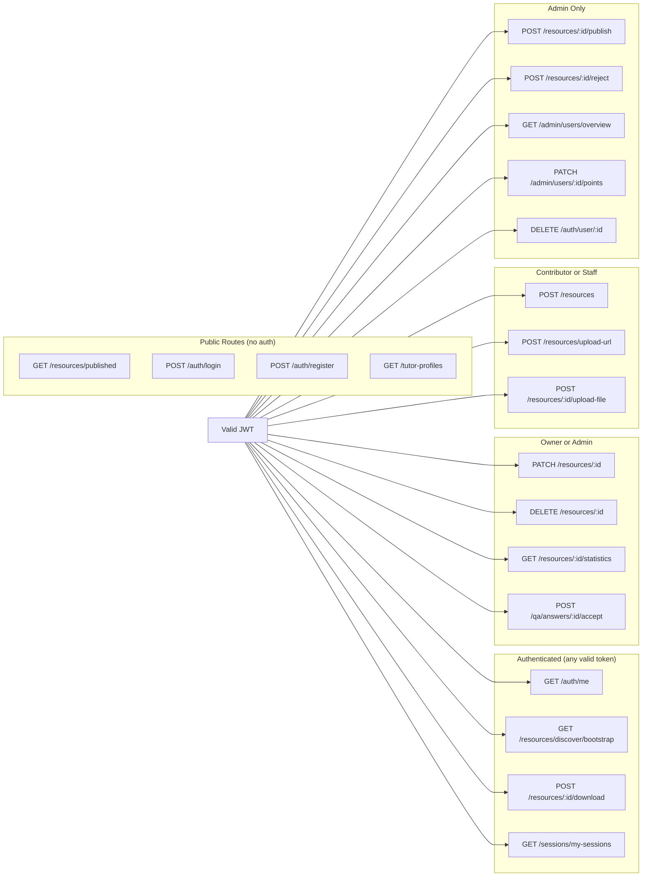
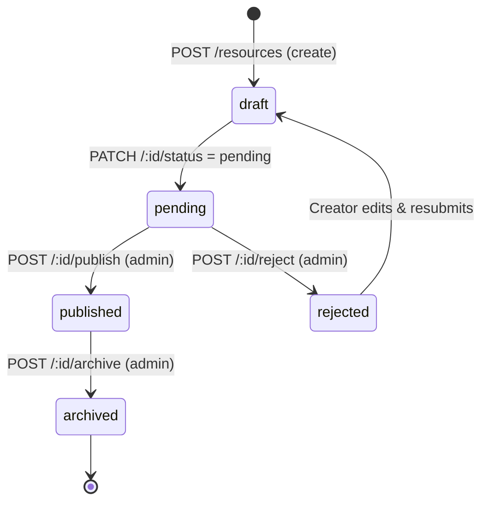
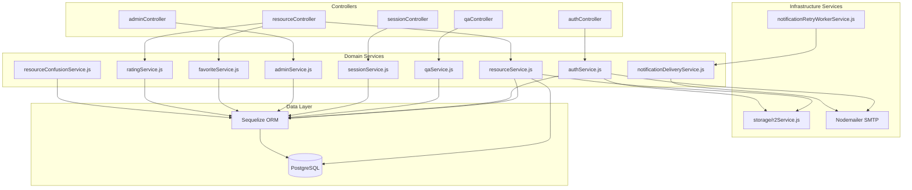
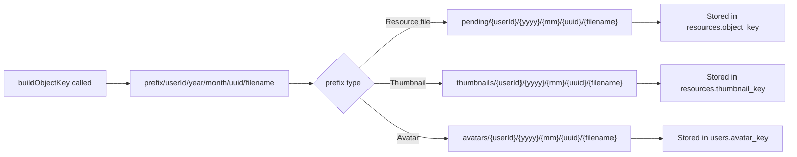
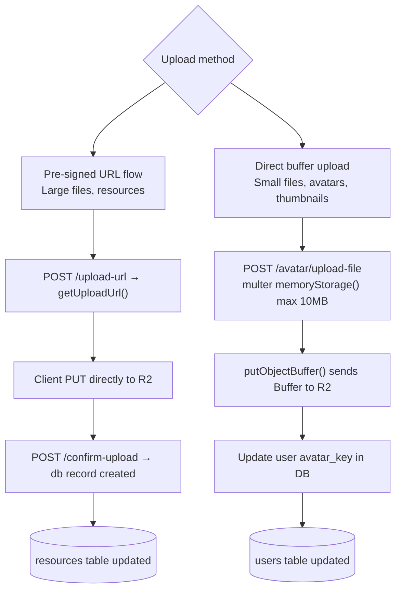
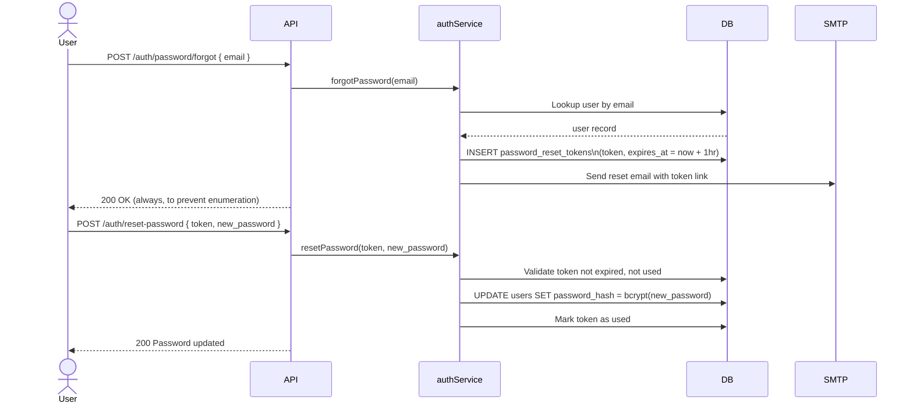
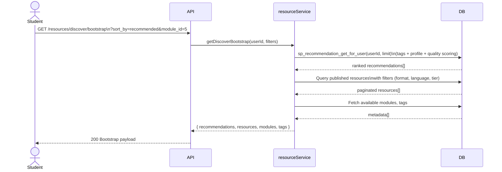
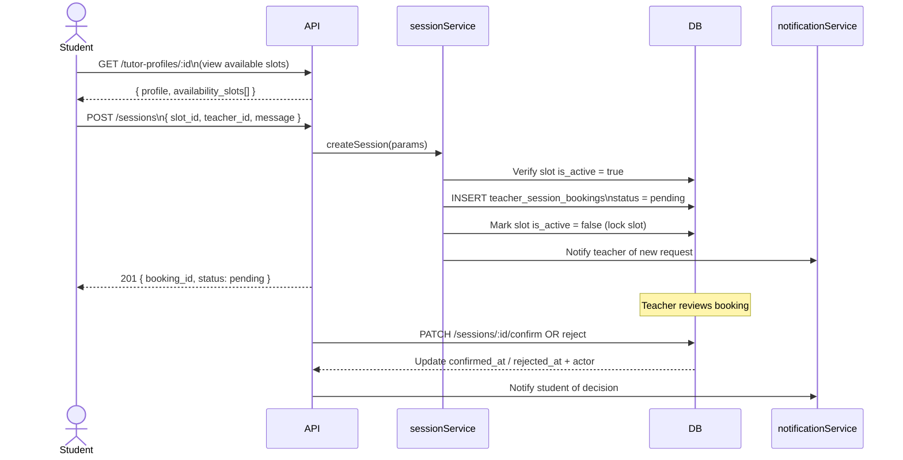

# Backend Architecture & Technical Documentation

## 1. PROJECT STRUCTURE

```
MUS-backend/
├── scripts/                # Standalone smoke tests, E2E validation scripts, and DB seeders
└── src/                    # Main application source code
    ├── config/             # Environment, Database (Sequelize), and Swagger configurations
    ├── controllers/        # Route handler functions handling HTTP req/res and validation
    ├── helpers/            # Application-wide utility helpers (AppError, asyncHandler, storage)
    ├── middleware/         # Express middleware (JWT auth, RBAC authorization, rate limiting)
    ├── models/             # Sequelize ORM data models, entity schemas, and associations
    ├── routes/             # Express router definitions and request validation chains
    ├── services/           # Core domain business logic, DB queries, and external integrations
    ├── snippets/           # Reusable SQL/JS code snippets and migration reference blocks
    └── utils/              # Cryptographic utilities (JWT signing/verifying, bcrypt password hashing)
```

* **Entry Point:** `index.js` — Loads environment variables, connects to PostgreSQL via Sequelize, initializes background notification workers, and starts the Express HTTP server.
* **Core Application:** `src/app.js` — Configures CORS, security headers (`helmet`), cookie parsing, rate limiting, Swagger UI documentation (`/api/docs`), API routing (`/api`), and centralized error-handling middleware.

---

## 2. ARCHITECTURE & DESIGN PATTERNS

* **Architectural Pattern:** Layered Architecture / MVC (Routes → Validation → Middleware → Controllers → Services → ORM Models).
* **Asynchronous Handling:** All async controller methods are wrapped in custom error catchers or rely on Express 5 compatible async error propagation.
* **Request Context Propagation:** Employs Node.js `node:async_hooks` `AsyncLocalStorage` (`src/helpers/storage.js`) to seamlessly propagate the active `req.user` payload across deeply nested service layers without manual argument drilling.
* **Error Handling Pipeline:** Handlers throw custom `AppError(message, statusCode)` instances. Uncaught exceptions are intercepted by Express error middleware (`src/app.js`), formatting consistent JSON responses (`{ success: false, error: message }`).

### Request Lifecycle Pipeline



---

## 3. AUTHENTICATION & SECURITY

### JWT Authentication Flow



### RBAC Authorization Matrix



* **JWT Strategy:** Tokens signed using `JWT_SECRET` (`src/utils/jwt.js`). Auth middleware (`src/middleware/auth.js`) extracts tokens from `Authorization: Bearer` headers or `auth_token` cookies.
* **RBAC Authorization (`src/middleware/authorization.js`):**
  * `requireAuth`: Enforces valid user authentication.
  * `requireRole("admin", "teacher")`: Validates decoded token roles against required arrays.
  * `requireOwnerOrAdmin`: Evaluates resource authorship vs. active user ID.
  * `requirePublishedOrOwnerOrAdmin`: Bypasses auth for published content while protecting draft/pending items.
  * `requireStudentContributorOrStaff`: Restricts upload capabilities to verified contributors or staff.
* **Security Middleware:** Employs `helmet` for secure HTTP response headers and `express-rate-limit` for DDoS protection (`authRateLimit`, `registerRateLimit`).
* **CORS Configuration:** Strictly validated against `ALLOWED_ORIGINS` / `CLIENT_ORIGIN` environment variables with cookie credentials enabled (`credentials: true`).

---

## 4. CONTROLLERS & ROUTES INVENTORY

### Authentication & Users (`/api/auth`)
* `POST /register` | controller: `register` | auth: none | Rate limited; registers user and provisions initial role.
* `POST /login` | controller: `login` | auth: none | Authenticates email/password, returns JWT token.
* `GET /me` | controller: `me` | auth: `authMiddleware` | Returns active user profile and RBAC permissions.
* `POST /logout` | controller: `logout` | auth: `authMiddleware` | Invalidates client session.
* `POST /email/check` | controller: `checkEmail` | auth: none | Verifies email availability.
* `POST /password/forgot` | controller: `forgotPassword` | auth: none | Dispatches password reset token email.
* `POST /reset-password` | controller: `resetUserPassword`| auth: none | Resets password using verification token.
* `PATCH /password` | controller: `updatePassword` | auth: `authMiddleware` | Updates user password from old password.
* `PATCH /profile` | controller: `updateUserProfile`| auth: `authMiddleware` | Updates full name and profile metadata.
* `POST /avatar/upload-file`| controller: `uploadAvatar` | auth: `authMiddleware` | Directly uploads user avatar buffer.
* `PATCH /active` | controller: `toggleActive` | auth: `authMiddleware` | Toggles user active/inactive account status.
* `GET /user/:id` | controller: `getUserById` | auth: `requireRole("admin")` | Admin inspection of user account.
* `PATCH /user/:id` | controller: `updateUser` | auth: `requireRole("admin")` | Admin modification of user attributes.
* `DELETE /user/:id` | controller: `removeUserById` | auth: `requireRole("admin")` | Admin deletion of user account.

### Learning Resources (`/api/resources`)
* `GET /` | controller: `listResources` | auth: optional | Lists public/filtered learning resources.
* `POST /` | controller: `addResource` | auth: `requireStudentContributorOrStaff` | Creates a new academic resource.
* `POST /upload-url` | controller: `requestResourceUploadUrlHandler` | auth: `requireStudentContributorOrStaff` | Generates R2/S3 pre-signed upload URL.
* `POST /confirm-upload` | controller: `confirmResourceUploadHandler` | auth: `requireStudentContributorOrStaff` | Confirms successful file upload and creates record.
* `GET /my-resources` | controller: `listMyResources` | auth: `authMiddleware` | Lists resources uploaded by the active user.
* `GET /my-analytics` | controller: `getMyResourceAnalyticsHandler` | auth: `authMiddleware` | Aggregated analytics for creator's resources.
* `GET /my-rejections` | controller: `listMyResourceRejectionsHandler` | auth: `authMiddleware` | Lists creator's rejected resource submissions.
* `GET /rejections` | controller: `listAllResourceRejectionsHandler` | auth: `requireRole("admin")` | Admin view of all rejected submissions.
* `GET /published` | controller: `listPublishedResources` | auth: none | Lists officially verified and published catalog.
* `GET /discover/bootstrap`| controller: `getDiscoverBootstrapHandler` | auth: `authMiddleware` | Initial discovery dashboard payload.
* `GET /:id` | controller: `getResource` | auth: `requirePublishedOrOwnerOrAdmin` | Inspects single resource entity.
* `PATCH /:id` | controller: `updateExistingResource`| auth: `requireOwnerOrAdmin` | Updates resource fields.
* `DELETE /:id` | controller: `deleteExistingResource`| auth: `requireOwnerOrAdmin` | Deletes resource entity.
* `PATCH /:id/metadata` | controller: `updateResourceMetadataHandler` | auth: `requireOwnerOrAdmin` | Updates JSON metadata context.
* `PATCH /:id/status` | controller: `updateResourceStatusHandler` | auth: `authMiddleware` | Updates moderation status.
* `POST /:id/publish` | controller: `publishResourceHandler` | auth: `requireRole("admin")` | Admin publishes pending resource.
* `POST /:id/archive` | controller: `archiveResourceHandler` | auth: `requireRole("admin")` | Admin archives active resource.
* `POST /:id/reject` | controller: `rejectResourceHandler` | auth: `requireRole("admin")` | Admin rejects pending resource with reason.
* `POST /:id/download` | controller: `downloadResourceHandler` | auth: `authMiddleware` | Records download event and evaluates gamification.
* `GET /:id/file-url` | controller: `getResourceFileUrlHandler` | auth: `requirePublishedOrOwnerOrAdmin` | Generates S3 pre-signed download URL.
* `GET /:id/details` | controller: `getResourceDetailsBundleHandler` | auth: `requirePublishedOrOwnerOrAdmin` | Full detail bundle including author and tags.
* `GET /:id/statistics` | controller: `getResourceStatisticsHandler` | auth: `requireOwnerOrAdmin` | Views, downloads, and engagement metrics.

### Resource Moderation Lifecycle



### Q&A & Community (`/api/qa`)
* `GET /resources/:id/questions` | controller: `listResourceQuestionsHandler` | auth: optional | Lists questions attached to a resource.
* `POST /resources/:id/questions`| controller: `askQuestionHandler` | auth: `authMiddleware` | Posts a new question on a resource.
* `POST /questions/:id/answers` | controller: `answerQuestionHandler` | auth: `authMiddleware` | Submits an answer to an existing question.
* `POST /questions/:id/vote` | controller: `voteQuestionHandler` | auth: `authMiddleware` | Upvotes/downvotes a question.
* `POST /answers/:id/vote` | controller: `voteAnswerHandler` | auth: `authMiddleware` | Upvotes/downvotes an answer.
* `POST /answers/:id/accept` | controller: `acceptAnswerHandler` | auth: `requireOwnerOrAdmin` | Marks an answer as accepted.

### Gamification, Wallet & Admin (`/api/admin`, `/api/wallet`, `/api/ratings`)
* `GET /admin/users/overview` | controller: `getUsersOverviewHandler` | auth: `requireRole("admin")` | Comprehensive user list with system metrics.
* `GET /admin/rewards/analytics` | controller: `getRewardsAnalyticsHandler` | auth: `requireRole("admin")` | Gamification overview and contributor metrics.
* `PATCH /admin/users/:id/points`| controller: `adjustUserPointsHandler` | auth: `requireRole("admin")` | Manually credits/debits user points.
* `GET /wallet/me/summary` | controller: `getMyWalletSummaryHandler` | auth: `requireRole("student", "teacher")` | User's wallet balance and point breakdown.
* `GET /wallet/me/transactions` | controller: `getMyTransactionsHandler` | auth: `requireRole("student", "teacher")` | Point ledger transaction history.
* `POST /ratings` | controller: `rateResourceHandler` | auth: `authMiddleware` | Submits 1-5 star rating and updates averages.

### Tutoring & Consultations (`/api/tutor-profiles`, `/api/sessions`)
* `GET /tutor-profiles` | controller: `listTutorProfilesHandler` | auth: none | Lists available tutors.
* `GET /tutor-profiles/:id` | controller: `getTutorProfileHandler` | auth: none | Detailed tutor profile and slots.
* `GET /sessions/my-sessions` | controller: `getMySessionsHandler` | auth: `authMiddleware` | Lists active tutoring sessions.
* `POST /sessions` | controller: `createSessionHandler` | auth: `authMiddleware` | Books a consultation slot.

### Academic Taxonomy (`/api/institutions`, `/api/modules`, `/api/tags`, etc.)
* CRUD endpoints across `/institutions`, `/institution-types`, `/domains`, `/programs`, `/levels`, `/semesters`, `/modules`, `/tags`. Admin protected for mutations (`POST`, `PATCH`, `DELETE`), public/authenticated for reads (`GET`).

---

## 5. SERVICES & BUSINESS LOGIC

### Service Layer Map



* `authService.js`: Handles user lifecycle, JWT provisioning, bcrypt hashing, avatar handling, and password reset flows.
* `resourceService.js`: Core CRUD operations, query builders, visibility filtering, S3 pre-signed URL coordination, and publishing/archiving workflows.
* `qaService.js`: Manages question and answer threads, nested voting ledgers, answer acceptance logic, and author notification triggers.
* `ratingService.js`: Evaluates rating submissions, calculates weighted average scores, and updates aggregated resource statistics.
* `favoriteService.js`: Toggles user resource favorites and updates creator gamification metrics.
* `sessionService.js`: Manages tutoring session scheduling, slot locking, and real-time messaging persistence.
* `adminService.js`: Aggregates cross-table platform metrics, reward analytics, and user point ledger adjustments.
* `storage/r2Service.js`: Coordinates Cloudflare R2 / AWS S3 client interactions, generating pre-signed PUT/GET URLs and executing direct buffer uploads.
* `notificationDeliveryService.js`: Handles in-app notifications, SSE stream broadcasting, and email delivery via Nodemailer.
* `resourceConfusionService.js`: Processes student confusion signals, triggering teacher alerts for difficult course modules.

---

## 6. STORAGE ARCHITECTURE (Cloudflare R2 / AWS S3)

### Storage System Overview

```mermaid
graph LR
    subgraph "Client Browser"
        FE[Frontend App]
    end

    subgraph "MUS Backend (Express)"
        API[API Server]
        R2SVC[r2Service.js\n@aws-sdk/client-s3]
    end

    subgraph "Cloudflare R2 / S3 Compatible"
        BUCKET[(R2 Bucket\npending/ & published/)]
        CDN[R2 Public URL\nfor thumbnails]
    end

    subgraph "PostgreSQL"
        DB[(resources table\nobject_key, bucket,\nmime_type, size_bytes)]
    end

    FE -- "1. POST /resources/upload-url\n(filename, mime_type)" --> API
    API -- "2. PutObjectCommand\n(signed URL generation)" --> R2SVC
    R2SVC -- "3. getSignedUrl\nTTL: env.R2_SIGNED_URL_TTL_SECONDS" --> BUCKET
    BUCKET -- "4. Return pre-signed PUT URL" --> R2SVC
    R2SVC -- "5. Return { uploadUrl, expiresIn }" --> API
    API -- "6. Return uploadUrl to client" --> FE
    FE -- "7. PUT file directly to R2\n(no backend bandwidth)" --> BUCKET
    FE -- "8. POST /resources/confirm-upload\n(object_key, metadata)" --> API
    API -- "9. INSERT resource record" --> DB

    FE -- "A. GET /resources/:id/file-url" --> API
    API -- "B. GetObjectCommand\n(signed download URL)" --> R2SVC
    R2SVC -- "C. getSignedUrl TTL: 900s default" --> BUCKET
    BUCKET -- "D. Return pre-signed GET URL" --> FE
    FE -- "E. Download file directly from R2" --> BUCKET
```

### Object Key Path Strategy



### Upload Variants



### r2Service.js Exported Functions

| Function | Direction | Auth Pattern | Use Case |
| :--- | :--- | :--- | :--- |
| `getUploadUrl()` | PUT → R2 | Pre-signed URL | Large resource file uploads |
| `getDownloadUrl()` | GET ← R2 | Pre-signed URL | Authenticated file downloads |
| `putObjectBuffer()` | PUT → R2 | Direct SDK call | Avatar / thumbnail buffer uploads |
| `headObject()` | HEAD → R2 | Direct SDK call | Validate object existence & metadata |
| `deleteObject()` | DELETE → R2 | Direct SDK call | Cleanup on resource deletion |
| `getPublicObjectUrl()` | Static URL | Public CDN | Thumbnail public access via R2 CDN |
| `buildObjectKey()` | Utility | — | Namespaced path: `prefix/userId/yyyy/mm/uuid/filename` |
| `isR2Configured()` | Guard | — | Checks all required env vars before operations |

---

## 7. KEY API FLOWS

### Password Reset Flow



### Resource Discovery Bootstrap Flow



### Session Booking Flow



---

## 8. DATA LAYER & ORM/DATABASE

* **Database Engine:** PostgreSQL (`pg`).
* **ORM:** Sequelize v6 (`sequelize`). Configured in `src/config/database.js` supporting SSL connection strings (`DATABASE_URL`) or granular environment variables (`DB_NAME`, `DB_USER`, `DB_PASSWORD`, `DB_HOST`, `DB_PORT`).

### Models Inventory
* `User` (`user.js`): Core authentication entity (email, password_hash, full_name, is_active, points).
* `Role` (`role.js`): RBAC role definitions (`admin`, `teacher`, `student`).
* `UserRole` (`userRole.js`): Join table mapping Users to Roles.
* `InstitutionType` (`institutionType.js`): Taxonomy of institution categories.
* `Institution` (`institution.js`): Academic universities / schools.
* `Domain` (`domain.js`): Broad academic faculties.
* `Program` (`program.js`): Specific academic majors/curricula.
* `InstitutionProgram` (`institutionProgram.js`): Join table mapping Institutions to Programs.
* `Level` (`level.js`): Academic years within a Program.
* `Semester` (`semester.js`): Semesters within an Academic Level.

---

## 9. KEY DEPENDENCIES

| Package Name | Version | Purpose |
| :--- | :--- | :--- |
| `express` | `^4.19.2` | High-performance HTTP server routing framework. |
| `sequelize` | `^6.37.7` | Promise-based Node.js ORM for PostgreSQL. |
| `pg` / `pg-hstore` | `^8.16.3` | Native PostgreSQL client bindings and serialization. |
| `jsonwebtoken` | `^9.0.3` | Cryptographic JWT signing and verification. |
| `bcrypt` | `^6.0.0` | Secure password hashing using salted Blowfish cipher. |
| `@aws-sdk/client-s3` | `^3.879.0` | AWS SDK v3 client for S3/R2 object storage interactions. |
| `express-validator`| `^7.3.1` | Express middleware for declarative payload validation. |
| `cors` | `^2.8.5` | Cross-Origin Resource Sharing middleware. |
| `helmet` | `^8.0.0` | Secure HTTP header injection. |
| `express-rate-limit`| `^7.4.1` | IP-based request rate limiting. |
| `multer` | `^2.1.0` | Multipart/form-data parsing for in-memory buffer uploads. |
| `nodemailer` | `^8.0.1` | SMTP client for transactional email dispatch. |
| `swagger-ui-express`| `^5.0.1` | Serves interactive OpenAPI / Swagger API documentation. |

---

## 10. KNOWN ISSUES & TODOS

* **In-Memory Multer Buffering:** Direct avatar and thumbnail uploads utilize `multer.memoryStorage()`. While restricted via file size limits, high-concurrency large uploads could impact server memory. The architectural roadmap prioritizes transitioning all binary ingestion to pre-signed client-side S3 URLs.
* **Notification Retry Queue:** Failed email notifications are currently managed via an in-memory periodic worker (`notificationRetryWorkerService.js`). Horizontal scaling across multiple backend pods will require migrating this queue to Redis or BullMQ.

---

## Quick Context for AI Agents

The MUS (Moroccan University Students) Backend is an Express + Sequelize PostgreSQL API providing robust academic taxonomy, resource sharing, Q&A, and tutoring capabilities. Authentication relies on JWTs passed via cookies or Bearer headers, with active user context seamlessly propagated across service layers using `AsyncLocalStorage`. Storage operations coordinate with Cloudflare R2 / AWS S3 via pre-signed URLs to offload bandwidth. When expanding features, adhere strictly to the Layered Architecture, declare strict request validation chains using `express-validator`, enforce RBAC permissions via existing authorization middleware, and throw standard `AppError` instances for centralized error handling.
