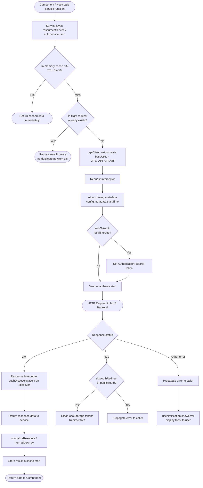
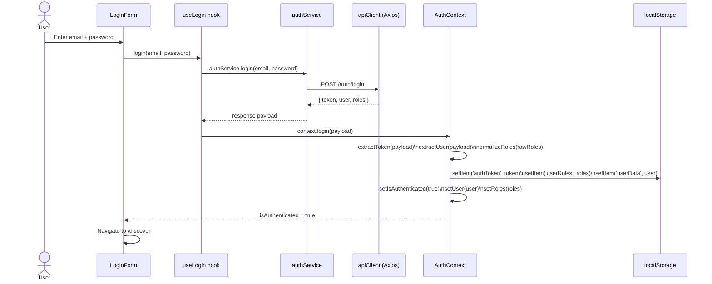
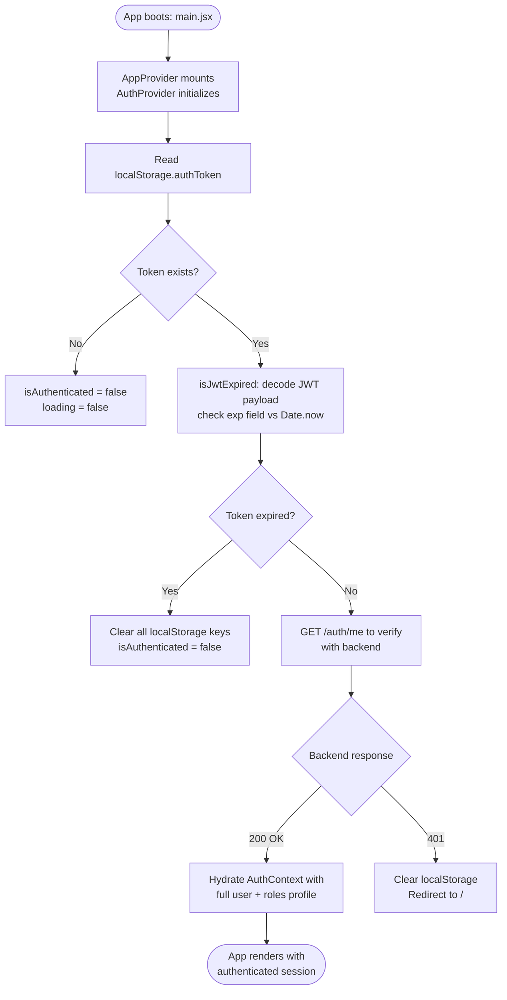
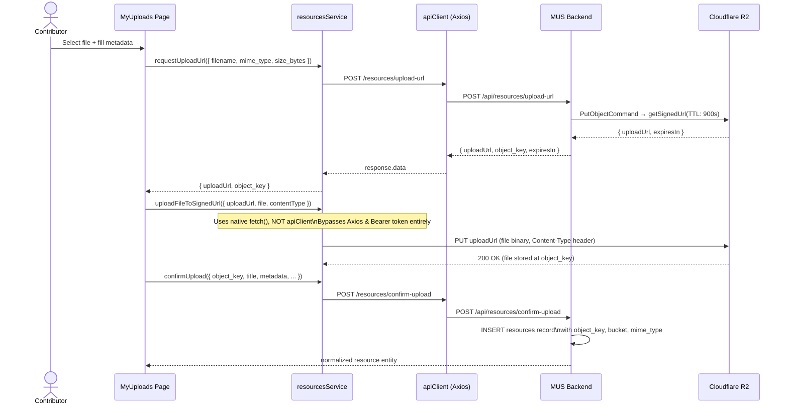
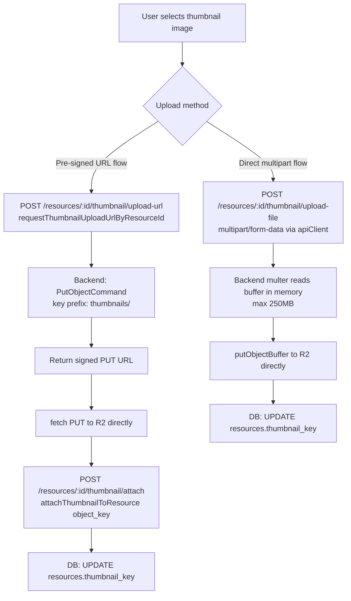
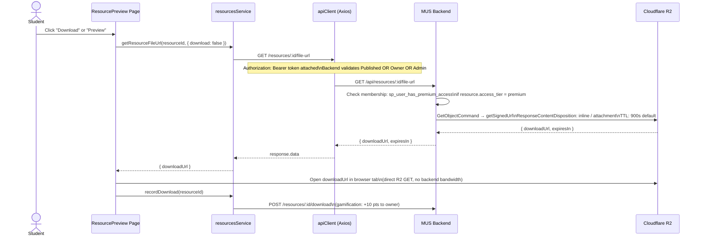
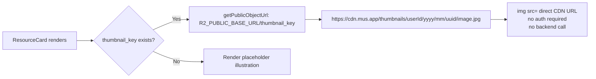
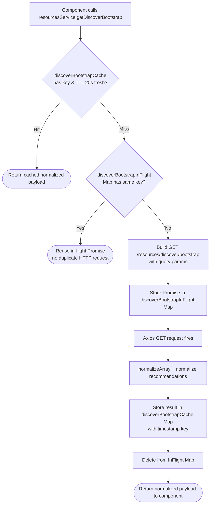
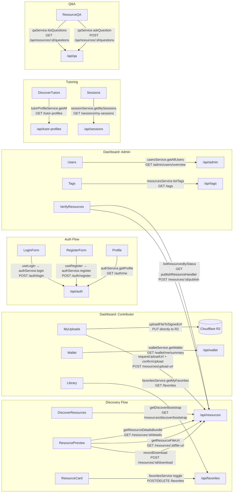

# Frontend Architecture & Technical Documentation

## 1. PROJECT STRUCTURE

```
MUS-frontend/
├── public/                 # Static public assets (favicons, manifest, static documents)
├── scripts/                # Helper scripts for build, environment setup, and deployment
└── src/                    # Main application source code
    ├── app/                # Core application setup: router definition and global context providers
    ├── assets/             # Static media assets, graphics, and illustrations
    ├── config/             # Navigation map definitions and static UI configuration constants
    ├── data/               # Static mock datasets and client-side content fixtures
    ├── entities/           # Domain entity definitions, schemas, and data models
    ├── features/           # Feature-sliced domain modules (auth, discover, dashboard, users, etc.)
    ├── layouts/            # Top-level page layout wrappers (DashboardLayout, SettingLayout)
    ├── pages/              # Public-facing and entry-level routing page components
    ├── services/           # REST API client services, HTTP interceptors, and caching layers
    ├── shared/             # Reusable UI primitives, form inputs, modals, and utility helpers
    └── styles/             # Global stylesheets, MUI theme configurations, and GSAP/Framer animations
```

* **Entry Point:** `src/main.jsx` — Bootstraps React root, Router, TanStack QueryClient, and AppProviders.
* **Root Component:** `src/App.jsx` — Manages dynamic page title resolution and renders the AppRouter.

---

## 2. THEME & DESIGN SYSTEM

Configured in `src/styles/theme.js` using Material-UI (`@mui/material/styles`).

| Token | Configuration / Value |
| :--- | :--- |
| **Typography** | Body: `Plus Jakarta Sans`, `Segoe UI`, `system-ui`. Headings (`h1`-`h6`): `Space Grotesk`. |
| **Spacing Unit** | Base unit `8px`. Global CSS vars from `--spacing-xs` (4px) to `--spacing-xxl` (48px). |
| **Border Radius** | Base shape `8px`. Overrides: Cards (`12px`), Chips (`6px`), Buttons (`8px`). |
| **Light Mode Colors**| Primary `#1976d2`, Secondary `#9c27b0`, Success `#2e7d32`, Bg Default `#f5f7fa`, Paper `#ffffff`. |
| **Dark Mode Colors** | Primary `#90caf9`, Secondary `#ce93d8`, Success `#66bb6a`, Bg Default `#0a0a0a`, Paper `#141414`. |
| **Shadows** | Adaptable CSS vars: `--shadow-sm`, `--shadow-md`, `--shadow-lg` for light vs. dark mode depths. |
| **Breakpoints** | Standard MUI grid breakpoints: `xs` (0px), `sm` (600px), `md` (900px), `lg` (1200px), `xl` (1536px). |
| **Theme Switching** | Managed by `ThemeContext.js`. Injects `data-theme` attribute on `<html>` root for CSS sync. |
| **Custom Overrides** | MuiButton elevation disabled; glassmorphism, scale transitions, and active press states added. |

---

## 3. COMPONENT INVENTORY

### Pages
* `PublicHome` | type: page | props: [] | state: [] | calls: [] | used in: [AppRouter]
* `NotFound` | type: page | props: [] | state: [] | calls: [] | used in: [AppRouter]
* `LoginPage` | type: page | props: [] | state: [] | calls: [useLogin] | used in: [AppRouter]
* `RegisterPage` | type: page | props: [] | state: [] | calls: [useRegister] | used in: [AppRouter]
* `DiscoverResources` | type: page | props: [] | state: [filters, viewMode] | calls: [useDiscoverResourcesController] | used in: [AppRouter]
* `Recommendations` | type: page | props: [] | state: [] | calls: [resourcesService.getDiscoverBootstrap] | used in: [AppRouter]
* `CreatorGuide` | type: page | props: [] | state: [] | calls: [] | used in: [AppRouter]
* `DiscoverTutors` | type: page | props: [] | state: [tutors, loading] | calls: [tutorProfileService.getAll] | used in: [AppRouter]
* `TutorProfileBooking` | type: page | props: [] | state: [tutor, booking] | calls: [tutorProfileService.getById] | used in: [AppRouter]
* `ResourcePreview` | type: page | props: [] | state: [resource, loading] | calls: [resourcesService.getResourceById] | used in: [AppRouter]
* `Overview` | type: page | props: [] | state: [] | calls: [useOverviewData] | used in: [AppRouter]
* `Users` | type: page | props: [] | state: [users, loading, search] | calls: [usersService.getAllUsers] | used in: [AppRouter]
* `PointsManagement` | type: page | props: [] | state: [users, history] | calls: [usersService.getUsersPointsOverview] | used in: [AppRouter]
* `Resources` | type: page | props: [] | state: [resources, filter] | calls: [resourcesService.getAdminResources] | used in: [AppRouter]
* `Library` | type: page | props: [] | state: [favorites] | calls: [favoritesService.getMyFavorites] | used in: [AppRouter]
* `MyUploads` | type: page | props: [] | state: [uploads, rejections] | calls: [resourcesService.getMyResources] | used in: [AppRouter]
* `Wallet` | type: page | props: [] | state: [balance, txs] | calls: [walletService.getWallet] | used in: [AppRouter]
* `Profile` | type: page | props: [] | state: [profileTab] | calls: [authService.getProfile] | used in: [AppRouter]
* `Settings` | type: page | props: [] | state: [activeTab] | calls: [userSettingsService.getByUserId] | used in: [AppRouter]
* `VerifyResources` | type: page | props: [] | state: [pending] | calls: [resourcesService.listResourcesByStatus] | used in: [AppRouter]
* `CatalogManagement` | type: page | props: [] | state: [activeTab] | calls: [institutionService, programService] | used in: [AppRouter]
* `Tags` | type: page | props: [] | state: [tags, search] | calls: [resourcesService.listTags] | used in: [AppRouter]
* `ConfusionCases` | type: page | props: [] | state: [cases] | calls: [confusionService.getAll] | used in: [AppRouter]
* `Sessions` | type: page | props: [] | state: [sessions] | calls: [sessionService.getMySessions] | used in: [AppRouter]

### Layouts
* `DashboardLayout` | type: layout | props: [] | state: [sidebarOpen] | calls: [useAuth, useNotification] | used in: [AppRouter]
* `SettingLayout` | type: layout | props: [children] | state: [] | calls: [] | used in: [Settings]

### UI & Feature Components
* `Navbar` | type: ui | props: [mobileOpen, onToggle] | state: [menuAnchor] | calls: [useAuth, useThemeMode] | used in: [DashboardLayout, PublicHome]
* `Sidebar` | type: ui | props: [open, onClose] | state: [collapsed] | calls: [useAuth] | used in: [DashboardLayout]
* `StatsOverview` | type: ui | props: [metrics, loading] | state: [] | calls: [] | used in: [Overview]
* `QuickActions` | type: ui | props: [role] | state: [] | calls: [useAuth] | used in: [Overview]
* `MiniChart` | type: ui | props: [data, dataKey, color] | state: [] | calls: [] | used in: [StatsOverview]
* `RecommendationResourceCard` | type: ui | props: [resource] | state: [] | calls: [] | used in: [Recommendations]
* `AdminOverviewWidgets` | type: ui | props: [metrics] | state: [] | calls: [] | used in: [Overview]
* `ContributorOverviewWidgets` | type: ui | props: [metrics] | state: [] | calls: [] | used in: [Overview]
* `DiscoverNavbar` | type: ui | props: [] | state: [] | calls: [useAuth] | used in: [DiscoverResources]
* `DiscoveryHeader` | type: ui | props: [onSearch, searchVal] | state: [] | calls: [] | used in: [DiscoverResources]
* `DiscoveryMainContent` | type: ui | props: [resources, loading] | state: [] | calls: [] | used in: [DiscoverResources]
* `DiscoverySidebar` | type: ui | props: [filters, onChange] | state: [] | calls: [] | used in: [DiscoverResources]
* `NotificationMenu` | type: ui | props: [anchorEl, onClose] | state: [notifications] | calls: [useNotifications] | used in: [Navbar]
* `ResourceCard` | type: ui | props: [resource, onFavorite] | state: [isFavorited] | calls: [favoritesService] | used in: [DiscoveryMainContent]
* `ResourcePreviewAuthActions` | type: ui | props: [resourceId] | state: [] | calls: [useAuth] | used in: [ResourcePreview]
* `ResourcePreviewNavLinks` | type: ui | props: [] | state: [] | calls: [] | used in: [ResourcePreview]
* `ResourceQA` | type: ui | props: [resourceId] | state: [questions, newQ] | calls: [qaService] | used in: [ResourcePreview]
* `ResourceRating` | type: ui | props: [resourceId, stats] | state: [ratingValue] | calls: [ratingService] | used in: [ResourcePreview]
* `DiscoverSearchBar` | type: ui | props: [value, onChange] | state: [] | calls: [] | used in: [DiscoveryHeader]
* `DiscoverFiltersPanel` | type: ui | props: [filters, onChange] | state: [expanded] | calls: [] | used in: [DiscoverySidebar]
* `DiscoverResourceSections` | type: ui | props: [sectionsData] | state: [] | calls: [] | used in: [DiscoveryMainContent]
* `UsersStatsCards` | type: ui | props: [stats] | state: [] | calls: [] | used in: [Users]
* `UsersTable` | type: ui | props: [users, onEdit, onDelete] | state: [page, rowsPerPage] | calls: [] | used in: [Users]
* `UserDetailsDialog` | type: ui | props: [user, open, onClose] | state: [activeTab] | calls: [] | used in: [Users]
* `ResourcesStatsCards` | type: ui | props: [stats] | state: [] | calls: [] | used in: [Resources]
* `ResourcesTable` | type: ui | props: [resources, onInspect] | state: [page, pageSize] | calls: [] | used in: [Resources]
* `ResourceDetailsDialog` | type: ui | props: [resource, open, onClose] | state: [tab] | calls: [resourcesService] | used in: [Resources]
* `ResourceReviewNoticeDialog` | type: ui | props: [open, onClose, onConfirm] | state: [notes] | calls: [] | used in: [Resources]
* `LibraryStatsCards` | type: ui | props: [stats] | state: [] | calls: [] | used in: [Library]
* `FavoritesTable` | type: ui | props: [favorites, onSelect] | state: [sort] | calls: [] | used in: [Library]
* `FavoriteDetailsDialog` | type: ui | props: [favorite, open, onClose] | state: [] | calls: [] | used in: [Library]
* `VerifyStatsCards` | type: ui | props: [stats] | state: [] | calls: [] | used in: [VerifyResources]
* `VerifyResourcesTable` | type: ui | props: [resources, onReview] | state: [] | calls: [] | used in: [VerifyResources]
* `VerifyResourceDialog` | type: ui | props: [resource, open, onClose] | state: [rejectionReason] | calls: [resourcesService] | used in: [VerifyResources]
* `CatalogPrimitives` | type: ui | props: [data, type, onMutate] | state: [dialogOpen] | calls: [institutionService] | used in: [CatalogManagement]
* `TagsTable` | type: ui | props: [tags, onEdit, onDelete] | state: [sorting] | calls: [] | used in: [Tags]
* `TagStatCard` | type: ui | props: [title, count, icon] | state: [] | calls: [] | used in: [Tags]
* `TagUsageBreakdown` | type: ui | props: [tagId] | state: [metrics, loading] | calls: [resourcesService] | used in: [Tags]
* `SessionCards` | type: ui | props: [sessions, onSelect] | state: [] | calls: [] | used in: [Sessions]
* `SessionChatDialog` | type: ui | props: [sessionId, open, onClose] | state: [messages, text] | calls: [sessionService] | used in: [Sessions]
* `SessionSlotDialog` | type: ui | props: [tutorId, open, onClose] | state: [selectedSlot] | calls: [sessionService] | used in: [TutorProfileBooking]

### Forms & Inputs
* `LoginForm` | type: form | props: [onSuccess] | state: [email, password] | calls: [useLogin] | used in: [LoginPage]
* `RegisterForm` | type: form | props: [onSuccess] | state: [formData, errors] | calls: [useRegister] | used in: [RegisterPage]
* `EditProfileDialog` | type: form | props: [open, onClose] | state: [fullName, avatar] | calls: [authService.updateProfile] | used in: [Profile]
* `ChangePasswordDialog` | type: form | props: [open, onClose] | state: [oldPass, newPass] | calls: [authService.updatePassword] | used in: [Profile]
* `DeleteAccountDialog` | type: form | props: [open, onClose] | state: [confirmText] | calls: [authService.deleteUser] | used in: [Settings]
* `TagFormDialog` | type: form | props: [tag, open, onClose] | state: [name, category] | calls: [tagService] | used in: [Tags]
* `UserDialog` | type: form | props: [user, open, onClose] | state: [role, status] | calls: [usersService.updateUser] | used in: [Users]
* `ResourceDialog` | type: form | props: [resource, open, onClose] | state: [metadataForm] | calls: [resourcesService] | used in: [Resources]
* `ForgotPasswordModal` | type: form | props: [open, onClose] | state: [email, success] | calls: [authService.forgotPassword] | used in: [LoginPage]
* `TextField` | type: ui | props: [label, value, onChange, error] | state: [] | calls: [] | used in: [Shared, Forms]
* `Select` | type: ui | props: [options, value, onChange] | state: [] | calls: [] | used in: [Shared, Forms]
* `Checkbox` | type: ui | props: [checked, onChange, label] | state: [] | calls: [] | used in: [Shared, Forms]
* `Radio` | type: ui | props: [options, selected, onChange] | state: [] | calls: [] | used in: [Shared, Forms]
* `Switch` | type: ui | props: [checked, onChange, label] | state: [] | calls: [] | used in: [Shared, Forms]
* `TextArea` | type: ui | props: [rows, value, onChange] | state: [] | calls: [] | used in: [Shared, Forms]

### Data Display & Shared Primitives
* `PrimaryButton` | type: ui | props: [onClick, loading, disabled, children] | state: [] | calls: [] | used in: [Shared]
* `SecondaryButton` | type: ui | props: [onClick, disabled, children] | state: [] | calls: [] | used in: [Shared]
* `OutlinedButton` | type: ui | props: [onClick, children] | state: [] | calls: [] | used in: [Shared]
* `TextButton` | type: ui | props: [onClick, children] | state: [] | calls: [] | used in: [Shared]
* `IconButton` | type: ui | props: [onClick, icon, tooltip] | state: [] | calls: [] | used in: [Shared]
* `Modal` | type: ui | props: [open, onClose, title, children] | state: [] | calls: [] | used in: [Shared]
* `ConfirmModal` | type: ui | props: [open, onClose, onConfirm, message] | state: [loading] | calls: [] | used in: [Shared]
* `AlertModal` | type: ui | props: [open, onClose, title, message] | state: [] | calls: [] | used in: [Shared]
* `Card` | type: ui | props: [children, elevation, sx] | state: [] | calls: [] | used in: [Shared]
* `Badge` | type: ui | props: [count, color, children] | state: [] | calls: [] | used in: [Shared]
* `Avatar` | type: ui | props: [src, name, size] | state: [] | calls: [] | used in: [Shared]
* `Divider` | type: ui | props: [orientation, sx] | state: [] | calls: [] | used in: [Shared]
* `Loading` | type: ui | props: [fullscreen, size] | state: [] | calls: [] | used in: [Shared]
* `Skeleton` | type: ui | props: [variant, width, height] | state: [] | calls: [] | used in: [Shared]
* `Alert` | type: ui | props: [severity, message] | state: [] | calls: [] | used in: [Shared]
* `NotificationProvider` | type: ui | props: [children] | state: [toast] | calls: [] | used in: [main.jsx]

---

## 4. STATE MANAGEMENT

* **Global Architecture:** React Context API combined with TanStack React Query (`@tanstack/react-query`).
* **AuthContext (`src/features/auth/context/AuthContext.jsx`):** Manages user authentication, JWT storage, RBAC roles (`STUDENT`, `TEACHER`, `ADMIN`), premium membership status, and contribution mode toggles.
* **ThemeContext (`src/app/providers/ThemeContext.js`):** Controls light/dark mode preference and propagates CSS custom property updates.
* **LanguageContext (`src/app/providers/LanguageContext.jsx`):** Manages internationalization (`i18n`) dictionaries and provides the translation function `t()`.
* **NotificationContext (`src/shared/components/ui/notifications`):** Global snackbar/toast management providing `showSuccess`, `showError`, `showWarning`, `showInfo` hooks.

```
+-----------------------------------------------------------------------+
|                        Data Flow Architecture                         |
+-----------------------------------------------------------------------+
|                                                                       |
|   [Backend REST API] <--- Axios HTTP Interceptors (Authorization)     |
|           |                                                           |
|           v                                                           |
|   [Service Client Layer] (resourcesService, usersService, authService)|
|           |                                                           |
|           v                                                           |
|   [In-Memory / React Query Cache] (Configurable TTLs: 5s - 30s)       |
|           |                                                           |
|           v                                                           |
|   [Custom Domain Hooks] (useOverviewData, useAuthHooks, useDiscover)  |
|           |                                                           |
|           v                                                           |
|   [React Component Tree] (Reactive re-rendering & optimistic updates) |
|                                                                       |
+-----------------------------------------------------------------------+
```

---

## 5. API & DATA FETCHING

* **Base URL:** Configured in `src/services/api.js` via `import.meta.env.VITE_API_URL || "http://localhost:5000/api"`.
* **Auth Strategy:** Axios interceptors attach JWT Bearer tokens from `localStorage.getItem('authToken')`. Intercepts HTTP 401 to clear local session and trigger redirect to `/login` (bypassed if `skipAuthRedirect` is specified).

| Method | Endpoint | Used In | Purpose |
| :--- | :--- | :--- | :--- |
| **POST** | `/auth/login` | `LoginForm` | Authenticates user credentials and returns JWT token. |
| **POST** | `/auth/register` | `RegisterForm` | Creates a new user profile and provisions default RBAC roles. |
| **GET** | `/auth/me` | `AuthContext`, `Profile` | Fetches active user session, profile metadata, and membership. |
| **GET** | `/resources/discover/bootstrap`| `DiscoverResources` | Fetches initial discovery payload (resources, tags, modules). |
| **GET** | `/resources` | `Resources` | Paginated listing of filtered learning resources. |
| **POST** | `/resources` | `MyUploads` | Creates a new academic resource entry. |
| **POST** | `/resources/:id/upload-url`| `MyUploads` | Generates AWS S3 pre-signed PUT URLs for file attachments. |
| **GET** | `/resources/published` | `DiscoverResources` | Fetches verified, published content catalog. |
| **GET** | `/admin/users/overview` | `Users` | Admin overview listing all platform users and metrics. |
| **GET** | `/admin/rewards/analytics` | `PointsManagement` | Aggregated gamification statistics and contributor leaderboards. |
| **GET** | `/tags` | `Tags` | Fetches complete academic tagging taxonomy. |
| **GET** | `/sessions/my-sessions` | `Sessions` | Retrieves active tutoring consultations and schedules. |

* **Custom Data-Fetching Hooks:** `useLogin`, `useRegister`, `useLogout`, `useProfile`, `useUpdateProfile`, `useOverviewData`, `useDiscoverResourcesController`, `useNotifications`.

---

## 6. ROUTING

Configured in `src/app/router/index.jsx` using `react-router-dom` v7.

| Route Path | Component | Protected | Layout Wrapper | Allowed Roles |
| :--- | :--- | :--- | :--- | :--- |
| `/` | `PublicHome` | No | None | All |
| `/login` | `LoginPage` | No | None | All |
| `/register` | `RegisterPage` | No | None | All |
| `/discover` | `DiscoverResources` | Yes | None | All Protected |
| `/discover/recommendations` | `Recommendations` | Yes | None | All Protected |
| `/discover/how-to-become-creator`| `CreatorGuide` | Yes | None | All Protected |
| `/discover/tutors` | `DiscoverTutors` | Yes | None | `STUDENT`, `TEACHER` |
| `/discover/tutors/:tutorId` | `TutorProfileBooking`| Yes | None | `STUDENT`, `TEACHER` |
| `/discover/resources/:id/preview`| `ResourcePreview` | Yes | None | All Protected |
| `/dashboard` | `DashboardOverview` | Yes | `DashboardLayout` | All Protected |
| `/dashboard/users` | `UsersPage` | Yes | `DashboardLayout` | `ADMIN` |
| `/dashboard/points` | `PointsManagement` | Yes | `DashboardLayout` | `ADMIN` |
| `/dashboard/resources` | `ResourcesPage` | Yes | `DashboardLayout` | `ADMIN` |
| `/dashboard/library` | `LibraryPage` | Yes | `DashboardLayout` | `STUDENT`, `TEACHER` |
| `/dashboard/uploads` | `MyUploadsPage` | Yes | `DashboardLayout` | All (Contributor Mode) |
| `/dashboard/wallet` | `WalletPage` | Yes | `DashboardLayout` | `STUDENT`, `TEACHER` |
| `/dashboard/profile` | `ProfilePage` | Yes | `DashboardLayout` | All Protected |
| `/dashboard/settings` | `SettingsPage` | Yes | `DashboardLayout` | All Protected |
| `/dashboard/verify` | `VerifyResources` | Yes | `DashboardLayout` | `ADMIN` |
| `/dashboard/catalog` | `CatalogManagement` | Yes | `DashboardLayout` | `ADMIN` |
| `/dashboard/tags` | `TagsPage` | Yes | `DashboardLayout` | `ADMIN` |
| `/dashboard/confusion` | `ConfusionCases` | Yes | `DashboardLayout` | `ADMIN`, `TEACHER` |
| `/dashboard/sessions` | `SessionsPage` | Yes | `DashboardLayout` | `STUDENT`, `TEACHER` |
| `/404` | `NotFound` | No | None | All |

* **Auth Guards (`ProtectedRoute.jsx`):** Evaluates active `AuthContext`. Unauthenticated sessions are redirected to `/login`. Route-specific access control is enforced via `requiredRoles` and `blockedRoles` props. Role mismatch redirects users to `/discover` or `/404`.

---

## 7. KEY DEPENDENCIES

| Package Name | Version | Purpose |
| :--- | :--- | :--- |
| `react` / `react-dom` | `^19.2.0` | Core UI rendering framework. |
| `react-router-dom` | `^7.10.1` | Declarative routing and browser history management. |
| `@mui/material` | `^7.3.6` | Material-UI component library and styling engine. |
| `@emotion/react` | `^11.14.0` | Styled component engine powering MUI styling runtime. |
| `@tanstack/react-query`| `^5.99.0` | Asynchronous state management, server state caching, and deduplication. |
| `axios` | `^1.13.2` | Promise-based REST HTTP client with request/response interceptors. |
| `framer-motion` | `^12.38.0` | High-performance spring physics and layout animation engine. |
| `gsap` | `^3.14.2` | Complex timeline, scroll-driven, and micro-interaction animations. |
| `react-hook-form` | `^7.71.2` | High-performance, uncontrolled form state validation. |
| `recharts` | `^3.7.0` | D3-based charting library for dashboard analytics. |
| `simplebar-react` | `^3.3.2` | Custom cross-browser overlay scrollbar rendering. |

---

## 8. PATTERNS & CONVENTIONS

* **Styling Approach:** Utilizes MUI `sx` prop objects combined with global CSS variables (`var(--color-primary)`). Dynamic styling functions (e.g., `cardBackgroundSx`) ensure seamless theme transitions.
* **Import Ordering:** Strict order enforced: 1. External dependencies (`react`, `@mui`), 2. Absolute path aliases (`@/services`, `@/features`), 3. Relative component imports.
* **TypeScript & Type Safety:** Codebase uses `.jsx` with exhaustive JSDoc runtime typing and React `prop-types` validation.
* **Custom Hooks Naming:** Domain logic encapsulated in `use<Feature/Entity>` hooks (e.g., `useAuthHooks`, `useOverviewData`).
* **Error Handling:** Centralized API catch blocks normalize server error strings (`err.response?.data?.message || err.message`) and dispatch them to the user via `useNotification().showError()`.
* **Loading & Empty States:** Lazy-loaded routes wrapped in `Suspense` with `LoadingFallback`. Data tables and grids utilize MUI `<Skeleton />` placeholders during data resolution and render dedicated illustration cards when arrays are empty.

---

## 9. KNOWN ISSUES & TODOS

* **Unified React Query Migration:** Custom service caching layers (`resourcesService`, `usersService`) currently utilize in-memory Maps with explicit TTL timeouts. A planned refactor aims to fully migrate these into TanStack React Query keys for unified garbage collection and cache invalidation.
* **In-Flight Request Deduplication:** To prevent redundant network calls during React StrictMode double-mounting in development, API services maintain dedicated in-flight request tracking maps (`resourceListInFlight`).

---

## Quick Context for AI Agents

The MUS (Moroccan University Students) Platform is a premium React 19 frontend application built on Material-UI, Framer Motion, and TanStack Query. It serves as an academic hub with distinct role-based workflows for Students, Teachers, and Admins. Data fetching is handled via Axios with JWT Bearer authentication, syncing server state with local context providers for theme, i18n, and RBAC permissions. When developing or refactoring components, ensure strict adherence to existing MUI `sx` styling tokens, preserve existing JSDoc/PropTypes definitions, and utilize the centralized notification system for error propagation.

---

## 10. API LIFECYCLE & DATA FETCHING

### Axios Client Pipeline (`src/services/api.js`)



### Auth Session Lifecycle



### JWT Persistence & Expiry Check



---

## 11. CLOUDFLARE R2 STORAGE — FETCH & UPLOAD FLOWS

### Resource File Upload via Pre-signed URL



### Thumbnail Upload (Per-Resource)



### Resource File Download / Preview via Pre-signed GET URL



### Public Thumbnail via R2 CDN (Static URL)



---

## 12. SERVICE CACHING LAYER

### In-Memory Cache Architecture (`resourcesService.js`)



### Cache TTL Reference

| Cache Target | In-Flight Map | TTL | Invalidation Trigger |
| :--- | :--- | :--- | :--- |
| `discoverBootstrapCache` | `discoverBootstrapInFlight` | **20s** | Any resource mutation |
| `publishedResourcesCache` | `publishedResourcesInFlight` | **30s** | Any resource mutation |
| `myResourcesCache` | `myResourcesInFlight` | **5s** | Any resource mutation |
| `resourceListCache` | `resourceListInFlight` | **5s** | Any resource mutation |
| `myRejectionsCache` | `myRejectionsInFlight` | **5s** | Any resource mutation |
| Tags (`tagListInFlight`) | `tagListInFlight` | **5s** | `invalidateTagCache()` |

> **Rule:** All cache Maps are flushed by `clearResourceListCaches()` on any successful `POST`, `PATCH`, or `DELETE` mutation against `/resources`.

---

## 13. COMPONENT → API WIRING MAP


