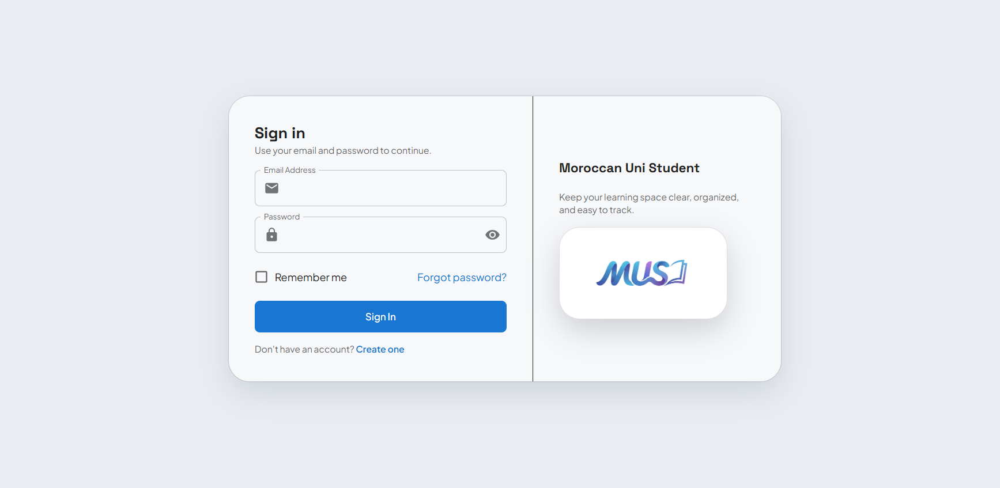
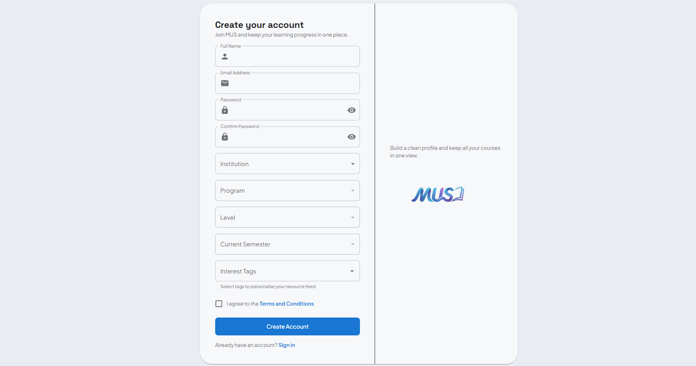
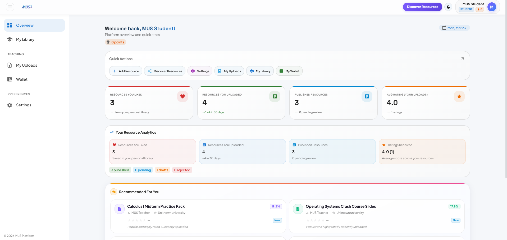
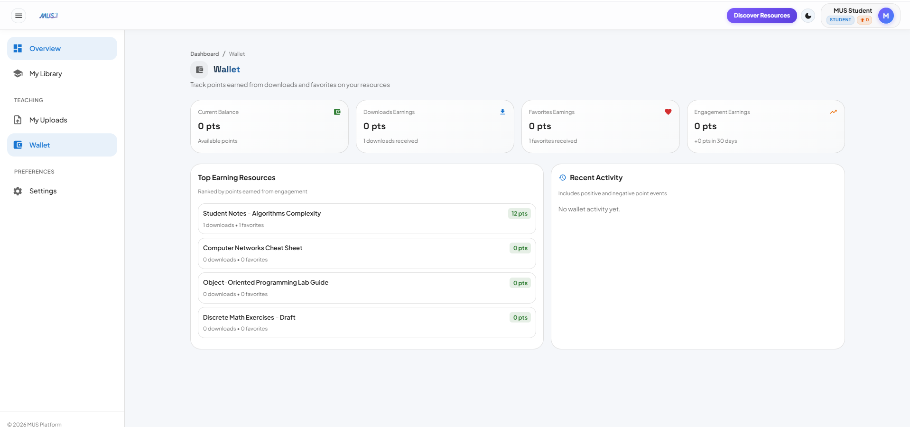
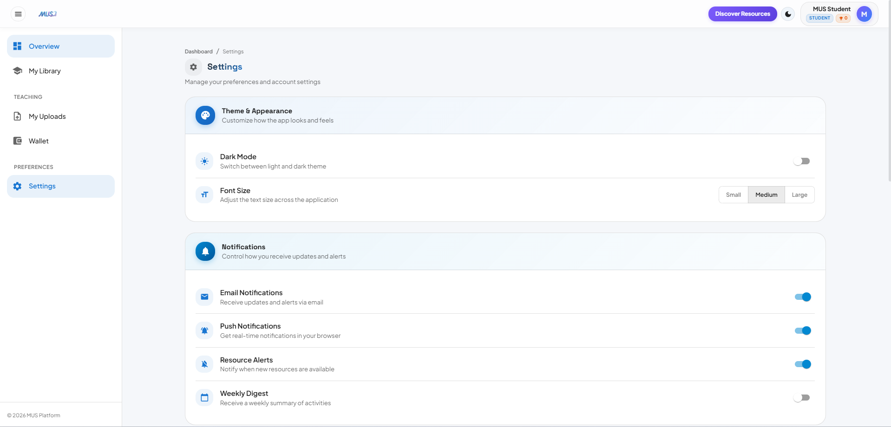

<div align="center">

# 🎓 MUS — Management University System

**A full-stack university platform for students, teachers, and administrators**

[](https://nodejs.org)
[](https://react.dev)
[](https://postgresql.org)
[](https://docker.com)
[](./LICENSE)

</div>

---

## 📖 Overview

**MUS** is an all-in-one university management platform that brings together academic resource sharing, content moderation, role-based dashboards, and a rich public discovery experience — all under one roof.

The system supports:

- 🔍 **Public resource discovery** without requiring a login
- 🌍 **Multilingual experience** (English, French, Arabic with RTL)
- 🎯 **Personalized recommendations** based on user profile and tags
- 💳 **Membership-gated downloads** and premium access tiers
- 📊 **Wallet & engagement analytics** with real-time tracking
- 🛡️ **Admin-driven moderation** with full verification workflows

---

## 🖼️ Screenshots

### 🌐 Public Experience

<table>
  <tr>
    <td align="center"><strong>Hero Section</strong></td>
    <td align="center"><strong>Platform Stats</strong></td>
  </tr>
  <tr>
    <td></td>
    <td></td>
  </tr>
  <tr>
    <td align="center"><strong>Features & Info</strong></td>
    <td align="center"><strong>Footer</strong></td>
  </tr>
  <tr>
    <td></td>
    <td></td>
  </tr>
</table>

---

### 🔐 Authentication

<table>
  <tr>
    <td align="center"><strong>Login</strong></td>
    <td align="center"><strong>Register</strong></td>
  </tr>
  <tr>
    <td></td>
    <td></td>
  </tr>
</table>

---

### 🛠️ Admin Dashboard

<table>
  <tr>
    <td align="center"><strong>Overview</strong></td>
    <td align="center"><strong>Overview (Alt)</strong></td>
  </tr>
  <tr>
    <td></td>
    <td></td>
  </tr>
  <tr>
    <td align="center"><strong>Users Management</strong></td>
    <td align="center"><strong>Resources Management</strong></td>
  </tr>
  <tr>
    <td></td>
    <td></td>
  </tr>
  <tr>
    <td align="center"><strong>Verification Queue</strong></td>
    <td align="center"><strong>Catalog Management</strong></td>
  </tr>
  <tr>
    <td></td>
    <td></td>
  </tr>
  <tr>
    <td align="center" colspan="2"><strong>Wallet & Analytics</strong></td>
  </tr>
  <tr>
    <td colspan="2" align="center"></td>
  </tr>
</table>

---

### 🎓 Student Dashboard

<table>
  <tr>
    <td align="center"><strong>Overview</strong></td>
    <td align="center"><strong>My Library</strong></td>
  </tr>
  <tr>
    <td></td>
    <td></td>
  </tr>
  <tr>
    <td align="center"><strong>My Uploads</strong></td>
    <td align="center"><strong>Wallet</strong></td>
  </tr>
  <tr>
    <td></td>
    <td></td>
  </tr>
  <tr>
    <td align="center"><strong>Settings</strong></td>
    <td align="center"><strong>Settings (Alt)</strong></td>
  </tr>
  <tr>
    <td></td>
    <td></td>
  </tr>
</table>

---

## ✨ Core Capabilities

<table>
<thead>
<tr><th width="220px">Capability</th><th>Description</th></tr>
</thead>
<tbody>
<tr>
  <td>🔐 <strong>Authentication & RBAC</strong></td>
  <td>JWT-based auth with register, login, and password reset. Roles: <code>student</code>, <code>teacher</code>, <code>admin</code>. Role-aware route protection and dashboard navigation.</td>
</tr>
<tr>
  <td>📚 <strong>Academic Resources</strong></td>
  <td>Upload, manage, and browse resources (notes, exams, summaries). Full metadata, tags, favorites, ratings, and search with advanced filtering.</td>
</tr>
<tr>
  <td>🛡️ <strong>Moderation & Verification</strong></td>
  <td>Admin verification workflow, rejection tracking, and moderation-safe status transitions. Confusion/reporting support on backend.</td>
</tr>
<tr>
  <td>🎯 <strong>Personalization</strong></td>
  <td>Student preference tags and recommendation APIs. Shared recommendation card used across Discover and Overview.</td>
</tr>
<tr>
  <td>💳 <strong>Membership & Access</strong></td>
  <td>Membership plans and user assignments. Free vs. premium resource tier with server-side download/file URL gating.</td>
</tr>
<tr>
  <td>💰 <strong>Wallet & Engagement</strong></td>
  <td>Wallet event ledger, summary endpoints, top resources/activity tracking, and a wallet UI page on the dashboard.</td>
</tr>
<tr>
  <td>🌐 <strong>Public Landing</strong></td>
  <td>Full-width animated public home page with hero, role/mission section, animated stats, and language switching (EN/FR/AR).</td>
</tr>
<tr>
  <td>🔎 <strong>Discover Page</strong></td>
  <td>Publicly accessible resource discovery at <code>/discover</code>. Grouped by universities/modules with author info, ratings, likes, and downloads.</td>
</tr>
</tbody>
</table>

---

## 🏗️ Tech Stack

| Layer | Technology |
|---|---|
| **Frontend** | React 19, Vite, Material UI (MUI), Emotion, React Router, React Hook Form |
| **Animations** | GSAP (scroll & entrance), Recharts (dashboard charts) |
| **HTTP Client** | Axios |
| **Backend** | Node.js, Express, Sequelize ORM |
| **Database** | PostgreSQL |
| **Auth** | JWT (cookie + Bearer token) |
| **Storage** | Cloudflare R2 (AWS S3-compatible SDK) |
| **Email** | Nodemailer (SMTP) |
| **Docs** | Swagger / OpenAPI |
| **Infrastructure** | Docker + Docker Compose |

---

## 📁 Repository Structure

```text
MUS/
├── MUS-frontend/          # React app — public site + dashboard
├── MUS-backend/           # Express API — services, routes, models
├── Database/
│   ├── database_DDL.sql   # Base schema
│   └── migrations/        # Incremental SQL migrations
├── docs/
│   ├── RECOMMENDATION_ALGORITHM.md
│   ├── V1_ADMIN_USERS_REWARDS_CATALOG_UPDATE.md
│   └── V1_SESSIONS_FEATURE.md
├── docker-compose.yml
└── README.md
```

---

## 🗺️ API Route Groups

All routes are mounted in `MUS-backend/src/routes/index.js`:

| Prefix | Purpose |
|---|---|
| `/api/auth` | Registration, login, profile, password management |
| `/api/resources` | Resource CRUD, uploads, search, file delivery |
| `/api/institutions`, `/api/programs`, `/api/levels`, ... | Academic catalog entities |
| `/api/ratings`, `/api/favorites`, `/api/tags` | Engagement features |
| `/api/memberships` | Plans and user membership |
| `/api/wallet` | Wallet summary and activity |
| `/api/personalization` | Preferences and recommendations |
| `/api/qa` | Q&A around resources and modules |
| `/api/admin` | Admin-only operations |

> **Swagger Docs:** `http://localhost:<PORT>/api/docs` · JSON: `http://localhost:<PORT>/api/docs.json`

---

## 🚀 Getting Started

### Prerequisites

- Node.js 18+
- npm
- PostgreSQL
- Docker *(optional, for containerized run)*

---

### Option 1 — Local Development

#### Step A: Database

```bash
# 1. Create a PostgreSQL database
# 2. Apply base schema
psql -d mus_db -f Database/database_DDL.sql
# 3. Apply any needed migrations from Database/migrations/
```

#### Step B: Backend

```bash
cd MUS-backend
npm install
```

Create `MUS-backend/.env`:

```env
PORT=5000

PGHOST=localhost
PGPORT=5432
PGUSER=postgres
PGPASSWORD=your_password
PGDATABASE=mus_db

JWT_SECRET=replace_with_strong_secret
JWT_EXPIRES_IN=1h

# Comma-separated origins (frontend URLs)
CLIENT_ORIGIN=http://localhost:5173,http://localhost:3000
```

```bash
npm run dev     # development (nodemon)
npm start       # production
```

#### Step C: Frontend

```bash
cd MUS-frontend
npm install
```

Create `MUS-frontend/.env`:

```env
VITE_API_URL=http://localhost:5000
```

```bash
npm run dev
```

> Frontend runs at **`http://localhost:5173`**

---

### Option 2 — Docker Compose

```bash
docker-compose up -d --build
```

| Service | URL |
|---|---|
| Frontend | `http://localhost:3000` |
| Backend | `http://localhost:5001` |

> The backend container reads env from `MUS-backend/.env`.  
> The frontend image uses `VITE_API_URL=http://localhost:5001` as a build arg.

---

## 📜 Available Scripts

### Frontend

| Command | Description |
|---|---|
| `npm run dev` | Start the Vite dev server |
| `npm run build` | Build for production |
| `npm run preview` | Preview the production build |
| `npm run lint` | Run ESLint |

### Backend

| Command | Description |
|---|---|
| `npm run dev` | Start with nodemon (auto-reload) |
| `npm start` | Start with node |

---

## 🔧 Environment Variables (Extended)

The backend may also require these depending on enabled features:

<details>
<summary>📬 Notifications & Worker</summary>

```env
NOTIFICATION_RETRY_ENABLED=
NOTIFICATION_RETRY_INTERVAL_MS=
NOTIFICATION_RETRY_RUN_ON_START=
NOTIFICATION_RETRY_BATCH_SIZE=
NOTIFICATION_RETRY_MAX_ATTEMPTS=
NOTIFICATION_RETRY_BASE_DELAY_SECONDS=
```

</details>

<details>
<summary>📧 Mail (SMTP)</summary>

```env
SMTP_HOST=
SMTP_PORT=
SMTP_FROM=
SMTP_USER=
SMTP_PASS=
SMTP_SECURE=
```

</details>

<details>
<summary>📢 Push Gateway</summary>

```env
PUSH_GATEWAY_URL=
PUSH_GATEWAY_TOKEN=
```

</details>

<details>
<summary>☁️ Storage (Cloudflare R2 / S3)</summary>

```env
R2_S3_ENDPOINT=
R2_BUCKET=
R2_ACCESS_KEY_ID=
R2_SECRET_ACCESS_KEY=
R2_SIGNED_URL_TTL_SECONDS=
R2_PUBLIC_BASE_URL=
```

</details>

---

## 🗂️ Frontend Routes

| Route | Access | Description |
|---|---|---|
| `/` | Public | Animated landing page |
| `/discover` | Public | Resource discovery (no login required) |
| `/login`, `/register` | Public | Authentication flows |
| `/dashboard` | Authenticated | Overview / home dashboard |
| `/dashboard/library` | All roles | Personal resource library |
| `/dashboard/uploads` | All roles | My uploaded resources |
| `/dashboard/wallet` | All roles | Wallet and engagement |
| `/dashboard/sessions` | Student/Teacher | Teacher slots, booking, and session chat |
| `/dashboard/profile` | All roles | User profile |
| `/dashboard/settings` | All roles | Account settings |
| `/dashboard/users` | Admin only | User management |
| `/dashboard/resources` | Admin only | Resource management |
| `/dashboard/verify` | Admin only | Moderation queue |
| `/dashboard/catalog` | Admin only | Academic catalog management |

---

## 📝 Development Notes

- API client base URL is normalized in `MUS-frontend/src/services/api.js`.
- Backend defaults to `PORT=5000` if not set.
- Ensure `CLIENT_ORIGIN` includes the frontend URL you're using.
- For production: set strong JWT secrets and lock down CORS/origin settings.
- Recommendation algorithm is documented in `docs/RECOMMENDATION_ALGORITHM.md`.
- Sessions feature is documented in `docs/V1_SESSIONS_FEATURE.md`.

---

## 📄 License

This project is **private/internal**. No open-source license is in effect unless explicitly added.
